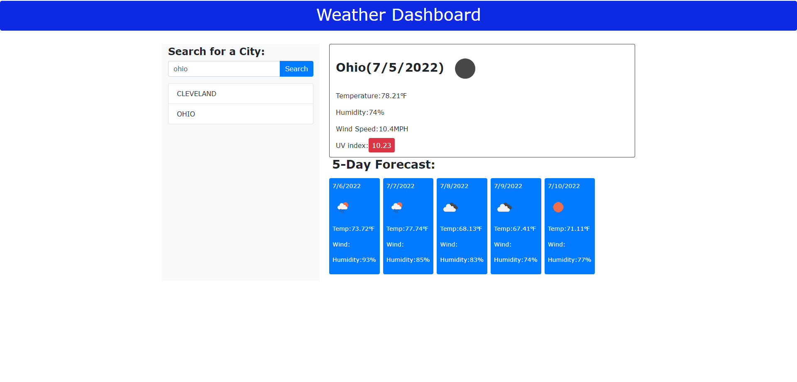

# Server-Side APIs Challenge: Weather Dashboard

5 Day Forecast

In challenge 6 I was able to practice using a weather api to view weather for the current and future dates.

Here's a screenshot: 

Deployable Link: https://mlmcdan1.github.io/WeatherDashboard/
